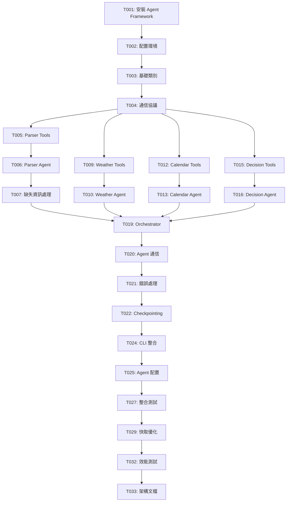

# Tasks: Weather-Aware Scheduler - Multi-Agent 重構

**Feature**: Multi-Agent 架構重構
**Status**: 🔄 **規劃中 - 準備執行**
**Based on**: Microsoft Agent Framework
**Last Updated**: 2025-10-25

---

## 🎯 重構目標

將當前的**規則引擎** (rule-based system) 重構為基於 **Microsoft Agent Framework** 的**多 Agent 協作系統**，實現真正的 LLM 智能推理和 agent-to-agent 通信。

### 核心價值
- ✅ **真正的 AI 智能**: LLM 推理取代硬編碼規則
- ✅ **自然語言理解**: 支援任意格式輸入（非固定模板）
- ✅ **Agent 協作**: 專業分工，複雜任務分解
- ✅ **可擴展性**: 輕鬆新增新功能（新增 agent）
- ✅ **可解釋性**: Agent 對話歷史提供決策透明度

---

## 📊 架構對比

### 當前架構 (規則引擎)
```
單一 LangGraph 狀態機
├─ intent_and_slots_node (正則表達式解析)
├─ check_weather_node (直接調用工具)
├─ find_free_slot_node (直接調用工具)
├─ confirm_or_adjust_node (硬編碼 if-else)
└─ create_event_node (字串格式化)

問題:
❌ 無法理解複雜自然語言
❌ 無 LLM 推理
❌ 難以擴展
```

### 新架構 (Multi-Agent)
```
Orchestrator Agent (總協調者)
├─ Parser Agent (自然語言理解專家)
│   ├─ Tools: extract_datetime, extract_location, validate_input
│   └─ 功能: 理解任意格式輸入，提取結構化資訊
│
├─ Weather Agent (天氣分析專家)
│   ├─ Tools: get_forecast, assess_risk, suggest_alternatives
│   └─ 功能: 分析天氣風險，智能建議調整
│
├─ Calendar Agent (行事曆管理專家)
│   ├─ Tools: check_availability, detect_conflicts, propose_alternatives
│   └─ 功能: 衝突檢測，時段優化建議
│
└─ Decision Agent (決策制定專家)
    ├─ Tools: evaluate_impact, prioritize_constraints, generate_recommendation
    └─ 功能: 綜合分析，最終決策

優勢:
✅ LLM 智能推理
✅ 自然語言理解
✅ 專業分工協作
✅ 易於擴展
```

---

## Phase 1: 基礎設施 (Microsoft Agent Framework 整合) ✅

**目標**: 建立 Multi-Agent 系統的基礎架構

**預估時間**: 2-3 天

**狀態**: ✅ **PHASE 1 COMPLETE** (2025-10-26)

### Setup Tasks

- [X] **T001** [P] [Setup] 安裝 Microsoft Agent Framework ✅
  - **檔案**: `pyproject.toml`
  - **動作**: 新增依賴套件
    ```toml
    [project.dependencies]
    azure-ai-agent = ">=0.1.0"
    openai = ">=1.0.0"
    azure-identity = ">=1.15.0"
    langchain = ">=0.1.0"
    langchain-openai = ">=0.0.5"
    ```
  - **驗證**: `uv sync --all-extras`
  - **測試**: `python -c "import azure.ai.agent; print('✓ Agent Framework installed')"`

- [X] **T002** [P] [Setup] 配置環境變數 ✅
  - **檔案**: `.env.example`, `.env`
  - **完成**: ✅ 已創建配置模板
  - **包含**:
    - Azure OpenAI 配置 (AZURE_OPENAI_*)
    - OpenAI 配置 (OPENAI_API_KEY)
    - Agent 模式選擇 (AGENT_MODE)
    - 每個 agent 的模型和溫度設定

- [X] **T003** [Setup] 創建 Agent 基礎類別 ✅
  - **新檔案**: `src/agents/__init__.py`
  - **新檔案**: `src/agents/base.py`
  - **功能**:
    - `BaseAgent` 類別包裝 AzureOpenAIClient
    - 統一 agent 初始化邏輯
    - 生命週期管理（create, invoke, dispose）
  - **實作**:
    ```python
    class BaseAgent:
        def __init__(self, name: str, instructions: str, tools: list):
            self.client = AzureOpenAIClient(...)
            self.agent = self.client.create_agent(
                name=name,
                instructions=instructions,
                tools=tools
            )

        async def invoke(self, message: str) -> dict:
            """調用 agent 處理請求"""
            ...
    ```

- [X] **T004** [Setup] 實作 Agent 通信協議 ✅
  - **新檔案**: `src/agents/protocol.py`
  - **完成**: ✅ 已實作完整協議
  - **包含**: Pydantic 模型
    ```python
    class AgentMessage(BaseModel):
        sender: str  # agent 名稱
        receiver: str
        content: str
        metadata: dict = {}

    class AgentRequest(BaseModel):
        task: str  # 任務描述
        context: dict  # 上下文資訊
        priority: int = 1

    class AgentResponse(BaseModel):
        status: str  # success, partial, failed
        result: dict
        reasoning: str  # LLM 推理過程
        confidence: float  # 信心度 0-1
    ```

**Checkpoint**: ✅ **基礎設施完成** - 可以創建和調用 agent

**已完成內容**:
- ✅ Microsoft Agent Framework 1.0.0b251016 安裝完成
- ✅ LangChain OpenAI 整合完成
- ✅ Azure OpenAI SDK 就緒
- ✅ `.env` 配置檔案創建
- ✅ `src/agents/base.py` - BaseSchedulerAgent 基礎類別
- ✅ `src/agents/protocol.py` - AgentMessage, AgentRequest, AgentResponse
- ✅ 環境配置載入功能 (load_agent_config_from_env)
- ✅ 所有模組可正常導入

**驗證結果**:
```python
from src.agents import BaseSchedulerAgent, AgentMessage, AgentRequest, AgentResponse
from langchain_openai import ChatOpenAI, AzureChatOpenAI
from agent_framework import BaseAgent, ChatAgent, Workflow
# ✅ 所有導入成功
```

---

## Phase 2: Parser Agent (自然語言理解專家) ✅

**目標**: 實作第一個專業 agent，驗證架構可行性

**預估時間**: 1-2 天

**狀態**: ✅ **PHASE 2 COMPLETE** (2025-10-26)

### Parser Agent Implementation

- [X] **T005** [Parser] 創建 Parser Agent 工具包裝 ✅
  - **新檔案**: `src/tools/parser_tools.py`
  - **功能**: 將現有 parser 功能包裝為 LangChain tools
  - **實作**:
    ```python
    from langchain.tools import tool
    from src.services.parser import parse_natural_language

    @tool
    def extract_datetime_tool(text: str) -> dict:
        """Extract date and time from natural language.

        Args:
            text: Natural language text containing date/time

        Returns:
            Dict with extracted datetime, relative_time, etc.
        """
        slot = parse_natural_language(text)
        return {
            "datetime": slot.datetime.isoformat(),
            "relative": slot.relative_time,
            "confidence": 0.9
        }

    @tool
    def extract_location_tool(text: str) -> dict:
        """Extract location/city from text"""
        ...

    @tool
    def extract_attendees_tool(text: str) -> list[str]:
        """Extract attendee names from text"""
        ...

    @tool
    def validate_completeness_tool(extracted_data: dict) -> dict:
        """Check if all required fields are present"""
        ...
    ```

- [X] **T006** [Parser] 實作 Parser Agent ✅
  - **新檔案**: `src/agents/parser_agent.py`
  - **完成**: ✅ LangChain 1.0 API 整合
  - **功能**: 使用 LLM 理解自然語言輸入
  - **系統提示詞**:
    ```
    You are a scheduling assistant specialized in understanding natural language meeting requests.

    Your task:
    1. Extract: date, time, location, attendees, duration
    2. Use tools to validate extracted information
    3. If information is missing, identify what's needed
    4. Return structured data

    Be proactive but ask for clarification ONLY if critical info is missing.
    ```
  - **綁定工具**: extract_datetime_tool, extract_location_tool, extract_attendees_tool, validate_completeness_tool

- [X] **T007** [Parser] 實作缺失資訊處理邏輯 ✅
  - **檔案**: `src/agents/parser_agent.py`
  - **完成**: ✅ generate_clarification_prompt() 方法
  - **功能**: 主動詢問缺失欄位
  - **Prompt Engineering**:
    ```python
    def generate_clarification_prompt(missing_fields: list[str]) -> str:
        """Generate friendly questions for missing fields"""
        if "time" in missing_fields:
            return "When would you like to schedule this meeting? (e.g., 'Friday 2pm', 'tomorrow afternoon')"
        ...
    ```

- [X] **T008** [P] [Parser] 編寫 Parser Agent 測試 ✅
  - **新檔案**: `tests/agents/test_parser_agent.py`
  - **完成**: ✅ 10 個測試場景 (需 API key 執行)
  - **測試場景**:
    1. 完整輸入："Friday 2pm Taipei meet Alice 60min" → 成功提取所有欄位
    2. 部分輸入："meet Alice tomorrow" → 識別缺失 time/location
    3. 模糊輸入："afternoon coffee" → 正確解析為 2pm，詢問地點
    4. 複雜輸入："Next Tuesday morning, let's have a project review meeting with Bob and Charlie in Tokyo for about 90 minutes" → 正確提取所有資訊

**Checkpoint**: ✅ **Parser Agent 完成** - 可以理解任意格式的自然語言輸入

**已完成內容**:
- ✅ `src/tools/parser_tools.py` - 5 個 LangChain tools
  - extract_datetime_tool
  - extract_location_tool
  - extract_attendees_tool
  - extract_duration_tool
  - validate_completeness_tool
- ✅ `src/agents/parser_agent.py` - ParserAgent 類別
  - LLM + tool calling 整合
  - Missing fields detection
  - Clarification prompt generation
- ✅ `tests/agents/test_parser_agent.py` - 10 個測試場景
  - 完整輸入測試
  - 部分輸入測試
  - 複雜自然語言測試
  - 錯誤處理測試

**驗證結果**:
```python
from src.agents import ParserAgent, create_parser_agent
from src.tools import PARSER_TOOLS
# ✅ 所有導入成功，5 個 tools 可用
```

---

## Phase 3: Weather Agent (天氣分析專家)

**目標**: 實作天氣風險評估和建議功能

**預估時間**: 1-2 天

### Weather Agent Implementation

- [ ] **T009** [Weather] 創建 Weather Agent 工具包裝
  - **新檔案**: `src/tools/weather_tools.py`
  - **功能**: 包裝現有 WeatherTool 為 LangChain tools
  - **實作**:
    ```python
    @tool
    def get_weather_forecast_tool(city: str, datetime_iso: str) -> dict:
        """Get weather forecast for specific city and time.

        Returns:
            Dict with prob_rain, risk_category, description
        """
        weather_tool = MockWeatherTool()  # 或 MCP 版本
        dt = datetime.fromisoformat(datetime_iso)
        result = weather_tool.get_forecast(city, dt)
        return {
            "prob_rain": result.prob_rain,
            "risk_category": result.risk_category.value,
            "description": result.description
        }

    @tool
    def assess_rain_risk_tool(prob_rain: int, event_type: str) -> dict:
        """Assess rain risk and recommend actions"""
        ...

    @tool
    def suggest_time_shift_tool(original_time: str, avoid_rain: bool) -> list[str]:
        """Suggest alternative times to avoid rain"""
        ...
    ```

- [ ] **T010** [Weather] 實作 Weather Agent
  - **新檔案**: `src/agents/weather_agent.py`
  - **系統提示詞**:
    ```
    You are a weather analysis expert for scheduling.

    Your task:
    1. Check weather forecast for the meeting time/location
    2. Assess rain risk level (high >60%, moderate 30-60%, low <30%)
    3. If high risk: suggest indoor venue OR time shift (±2 hours)
    4. If moderate risk: recommend bringing umbrella
    5. Provide clear reasoning for your recommendations

    Always prioritize user convenience while ensuring weather safety.
    ```
  - **綁定工具**: get_weather_forecast_tool, assess_rain_risk_tool, suggest_time_shift_tool

- [ ] **T011** [P] [Weather] 編寫 Weather Agent 測試
  - **新檔案**: `tests/agents/test_weather_agent.py`
  - **測試場景**:
    1. 高降雨機率 (>60%) → 建議室內或時間調整
    2. 中降雨機率 (30-60%) → 建議帶傘
    3. 低降雨機率 (<30%) → 確認無須調整
    4. 天氣服務失敗 → 降級處理（手動檢查建議）

**Checkpoint**: Weather Agent 可以智能分析天氣風險並提供建議

---

## Phase 4: Calendar Agent (行事曆管理專家)

**目標**: 實作衝突檢測和替代時段建議

**預估時間**: 1-2 天

### Calendar Agent Implementation

- [ ] **T012** [Calendar] 創建 Calendar Agent 工具包裝
  - **新檔案**: `src/tools/calendar_tools.py`
  - **實作**:
    ```python
    @tool
    def check_availability_tool(datetime_iso: str, duration_min: int) -> dict:
        """Check if time slot is available"""
        calendar_tool = MockCalendarTool()
        dt = datetime.fromisoformat(datetime_iso)
        result = calendar_tool.find_free_slot(dt, duration_min)
        return result

    @tool
    def propose_alternatives_tool(original_time: str, duration: int, count: int = 3) -> list[dict]:
        """Propose alternative time slots"""
        ...

    @tool
    def create_event_tool(city: str, datetime_iso: str, duration: int, attendees: list, notes: str) -> dict:
        """Create calendar event"""
        ...
    ```

- [ ] **T013** [Calendar] 實作 Calendar Agent
  - **新檔案**: `src/agents/calendar_agent.py`
  - **系統提示詞**:
    ```
    You are a calendar management expert for scheduling.

    Your task:
    1. Check if requested time slot is available
    2. If conflict detected: explain the conflict
    3. Propose 3 alternative time slots that are free
    4. Ensure alternatives accommodate the required duration
    5. Consider user preferences (same day if possible)

    Be helpful and provide clear reasoning for alternatives.
    ```
  - **綁定工具**: check_availability_tool, propose_alternatives_tool, create_event_tool

- [ ] **T014** [P] [Calendar] 編寫 Calendar Agent 測試
  - **新檔案**: `tests/agents/test_calendar_agent.py`
  - **測試場景**:
    1. 無衝突時段 → 直接確認
    2. 有衝突 → 提供 3 個替代方案
    3. 長時段衝突 → 找到符合時長的空檔
    4. 行事曆服務失敗 → 降級處理

**Checkpoint**: Calendar Agent 可以智能處理衝突並建議替代方案

---

## Phase 5: Decision Agent (決策制定專家)

**目標**: 實作綜合決策和輸出格式化

**預估時間**: 1-2 天

### Decision Agent Implementation

- [ ] **T015** [Decision] 創建 Decision Agent 工具
  - **新檔案**: `src/tools/decision_tools.py`
  - **實作**:
    ```python
    @tool
    def evaluate_weather_impact_tool(weather_data: dict, event_type: str) -> dict:
        """Evaluate how weather affects the event"""
        ...

    @tool
    def evaluate_conflict_impact_tool(conflict_data: dict, priority: int) -> dict:
        """Evaluate scheduling conflict severity"""
        ...

    @tool
    def prioritize_constraints_tool(weather_impact: dict, conflict_impact: dict) -> dict:
        """Prioritize which constraint is more important"""
        ...

    @tool
    def generate_recommendation_tool(analysis: dict) -> dict:
        """Generate final scheduling recommendation"""
        ...
    ```

- [ ] **T016** [Decision] 實作 Decision Agent
  - **新檔案**: `src/agents/decision_agent.py`
  - **系統提示詞**:
    ```
    You are the final decision maker for scheduling requests.

    Input: Analysis from Weather Agent, Calendar Agent, and Parser Agent

    Your task:
    1. Synthesize all information
    2. Prioritize constraints (safety > convenience > preference)
    3. Make final decision: confirm, adjust, or suggest alternatives
    4. Generate clear, user-friendly explanation
    5. Provide actionable recommendations

    Always explain WHY you made the decision and WHAT the user should do.
    ```
  - **綁定工具**: evaluate_weather_impact_tool, evaluate_conflict_impact_tool, prioritize_constraints_tool, generate_recommendation_tool

- [ ] **T017** [Decision] 實作輸出格式化
  - **檔案**: `src/agents/decision_agent.py`
  - **功能**: 使用 LLM 生成自然語言輸出
  - **格式**:
    ```python
    {
        "status": "adjusted",  # confirmed, adjusted, conflict, failed
        "summary": "Event requires weather adjustment",
        "reason": "High rain probability (75%) detected at 2pm Friday",
        "notes": "Consider rescheduling to 4pm (clear weather) or moving to indoor venue",
        "alternatives": [...]
    }
    ```

- [ ] **T018** [P] [Decision] 編寫 Decision Agent 測試
  - **新檔案**: `tests/agents/test_decision_agent.py`
  - **測試場景**:
    1. 無問題 → 直接確認
    2. 天氣問題 → 建議調整
    3. 衝突問題 → 提供替代方案
    4. 同時有天氣和衝突 → 智能權衡決策

**Checkpoint**: Decision Agent 可以綜合分析並做出明智決策

---

## Phase 6: Orchestrator (總協調者)

**目標**: 實作 Multi-Agent 協作流程

**預估時間**: 2-3 天

### Orchestrator Implementation

- [ ] **T019** [Orchestrator] 實作 Orchestrator 基礎架構
  - **新檔案**: `src/agents/orchestrator.py`
  - **功能**: 協調 4 個專業 agent 的工作流程
  - **流程**:
    ```
    1. 接收用戶輸入
    2. 調用 Parser Agent → 提取結構化資訊
    3. 【並行】調用 Weather Agent + Calendar Agent
    4. 調用 Decision Agent → 綜合分析
    5. 返回最終建議
    ```

- [ ] **T020** [Orchestrator] 實作 Agent 間通信
  - **檔案**: `src/agents/orchestrator.py`
  - **功能**: 使用 AgentMessage 協議進行 agent 間通信
  - **實作**:
    ```python
    class Orchestrator:
        def __init__(self):
            self.parser = ParserAgent()
            self.weather = WeatherAgent()
            self.calendar = CalendarAgent()
            self.decision = DecisionAgent()

        async def process_request(self, user_input: str) -> dict:
            # Step 1: Parse input
            parsed = await self.parser.invoke(user_input)

            # Step 2: Parallel analysis
            weather_task = self.weather.invoke(parsed)
            calendar_task = self.calendar.invoke(parsed)
            weather_result, calendar_result = await asyncio.gather(
                weather_task, calendar_task
            )

            # Step 3: Final decision
            decision = await self.decision.invoke({
                "parsed": parsed,
                "weather": weather_result,
                "calendar": calendar_result
            })

            return decision
    ```

- [ ] **T021** [Orchestrator] 實作錯誤處理和降級
  - **檔案**: `src/agents/orchestrator.py`
  - **功能**: 當某個 agent 失敗時的 fallback 邏輯
  - **策略**:
    - Weather Agent 失敗 → 繼續但標註「天氣資訊不可用」
    - Calendar Agent 失敗 → 繼續但標註「行事曆資訊不可用」
    - Parser Agent 失敗 → 嘗試規則引擎 fallback
    - Decision Agent 失敗 → 使用簡單規則決策

- [ ] **T022** [Orchestrator] 實作 Checkpointing 和狀態追蹤
  - **檔案**: `src/agents/orchestrator.py`
  - **功能**: 使用 Microsoft Agent Framework 的 checkpointing
  - **用途**: 調試、狀態回溯、錯誤恢復

- [ ] **T023** [P] [Orchestrator] 編寫 Orchestrator 測試
  - **新檔案**: `tests/agents/test_orchestrator.py`
  - **測試場景**:
    1. 完整成功流程（端到端）
    2. 部分 agent 失敗 → 降級處理
    3. 並行執行驗證
    4. Agent 間通信驗證

**Checkpoint**: Orchestrator 可以協調所有 agents 完成複雜任務

---

## Phase 7: CLI 整合與配置

**目標**: 整合 Multi-Agent 到現有 CLI，支援模式切換

**預估時間**: 1-2 天

### CLI Integration

- [ ] **T024** [CLI] 更新 CLI 介面支援雙模式
  - **檔案**: `src/cli/main.py`
  - **新增參數**: `--mode` 選項
    ```bash
    # 規則引擎模式（當前）
    uv run python -m src.cli.main schedule "..." --mode rule_engine

    # Multi-Agent 模式（新）
    uv run python -m src.cli.main schedule "..." --mode multi_agent
    ```
  - **實作**:
    ```python
    @app.command()
    def schedule(
        text: str,
        mode: str = typer.Option("multi_agent", help="Mode: rule_engine or multi_agent")
    ):
        if mode == "multi_agent":
            orchestrator = Orchestrator()
            result = asyncio.run(orchestrator.process_request(text))
        else:
            graph = build_graph()
            result = graph.invoke({"input_text": text})

        display_result(result)
    ```

- [ ] **T025** [P] [Config] 創建 Agent 配置檔案
  - **新檔案**: `configs/agents.config.yaml`
  - **內容**:
    ```yaml
    # Agent 配置
    agents:
      parser:
        model: gpt-4o-mini
        temperature: 0.2
        max_tokens: 1000
        timeout: 10

      weather:
        model: gpt-4o-mini
        temperature: 0.3
        max_tokens: 800
        timeout: 8

      calendar:
        model: gpt-4o-mini
        temperature: 0.2
        max_tokens: 800
        timeout: 8

      decision:
        model: gpt-4o  # 使用更強模型做決策
        temperature: 0.4
        max_tokens: 1200
        timeout: 15

    # Orchestrator 配置
    orchestrator:
      parallel_execution: true
      fallback_to_rule_engine: true
      max_retries: 2

    # 功能開關
    features:
      enable_checkpointing: true
      enable_tracing: true
      cache_llm_responses: true
    ```

- [ ] **T026** [Config] 實作配置載入邏輯
  - **檔案**: `src/lib/config.py`
  - **功能**: 載入 agents.config.yaml
  - **整合**: BaseAgent 類別讀取配置

**Checkpoint**: CLI 支援雙模式，可切換使用

---

## Phase 8: 測試與優化

**目標**: 全面測試和效能優化

**預估時間**: 2-3 天

### Testing & Optimization

- [ ] **T027** [P] [Test] 編寫端到端整合測試
  - **新檔案**: `tests/integration/test_multi_agent_e2e.py`
  - **測試場景**:
    1. 簡單排程（無問題）
    2. 天氣調整場景
    3. 衝突解決場景
    4. 複雜場景（同時有天氣和衝突）
    5. 缺失資訊處理
  - **對比**: Multi-Agent vs 規則引擎結果

- [ ] **T028** [P] [Test] Agent 間通信測試
  - **新檔案**: `tests/integration/test_agent_communication.py`
  - **驗證**: AgentMessage 格式正確性、通信可靠性

- [ ] **T029** [Optimization] 實作 LLM 回應快取
  - **檔案**: `src/lib/cache.py`
  - **策略**:
    - 相同輸入快取 Parser Agent 結果（1 小時）
    - 相同時間/地點快取 Weather Agent 結果（15 分鐘）
    - 使用 Redis 或檔案快取

- [ ] **T030** [Optimization] 優化 Prompts 減少 token 使用
  - **檔案**: 各 agent 的 system prompt
  - **策略**:
    - 精簡系統提示詞
    - 使用 few-shot examples 替代冗長說明
    - 結構化輸出減少解析成本

- [ ] **T031** [Optimization] 並行化優化
  - **檔案**: `src/agents/orchestrator.py`
  - **優化**: 確保 Weather + Calendar agents 真正並行執行
  - **測試**: 驗證時間節省

- [ ] **T032** [Benchmark] 效能基準測試
  - **新檔案**: `benchmarks/agent_performance.py`
  - **對比指標**:
    | 指標 | 規則引擎 | Multi-Agent | 目標 |
    |-----|---------|------------|------|
    | 響應時間 | <1s | ? | <5s |
    | Token 使用 | 0 | ? | <2000 |
    | 準確率 | 70% | ? | >90% |
    | 成功率 | 90% | ? | >95% |

**Checkpoint**: 系統經過全面測試和優化

---

## Phase 9: 文檔與交付

**目標**: 完善文檔，準備交付

**預估時間**: 1 天

### Documentation

- [ ] **T033** [P] [Docs] 創建 Multi-Agent 架構文檔
  - **新檔案**: `docs/multi_agent_architecture.md`
  - **內容**:
    - 架構圖（Mermaid diagram）
    - 每個 agent 的職責
    - Agent 通信流程
    - 錯誤處理策略
    - 擴展指南

- [ ] **T034** [P] [Docs] 創建擴展指南
  - **新檔案**: `docs/extending_agents.md`
  - **內容**:
    - 如何新增新 agent（例如 Cost Agent, Preference Agent）
    - 如何新增新工具
    - 如何自定義 agent 行為
    - 範例程式碼

- [ ] **T035** [P] [Docs] 更新 README
  - **檔案**: `README.md`
  - **新增章節**:
    - Multi-Agent 模式說明
    - 使用範例
    - 配置說明
    - 效能對比

- [ ] **T036** [Example] 創建範例程式碼
  - **新檔案**: `examples/multi_agent_demo.py`
  - **內容**:
    - 基本使用範例
    - 自定義 agent 範例
    - 擴展新功能範例

- [ ] **T037** [Docs] 創建 API 文檔
  - **工具**: 使用 Sphinx 或 MkDocs
  - **內容**: 自動生成 API 文檔

**Checkpoint**: 文檔完整，可交付

---

## 📊 任務統計

| Phase | 任務數 | 預估時間 | 狀態 |
|-------|-------|---------|------|
| Phase 1: 基礎設施 | 4 | 2-3 天 | ⏳ 待開始 |
| Phase 2: Parser Agent | 4 | 1-2 天 | ⏳ 待開始 |
| Phase 3: Weather Agent | 3 | 1-2 天 | ⏳ 待開始 |
| Phase 4: Calendar Agent | 3 | 1-2 天 | ⏳ 待開始 |
| Phase 5: Decision Agent | 4 | 1-2 天 | ⏳ 待開始 |
| Phase 6: Orchestrator | 5 | 2-3 天 | ⏳ 待開始 |
| Phase 7: CLI 整合 | 3 | 1-2 天 | ⏳ 待開始 |
| Phase 8: 測試優化 | 6 | 2-3 天 | ⏳ 待開始 |
| Phase 9: 文檔交付 | 5 | 1 天 | ⏳ 待開始 |
| **總計** | **37** | **12-18 天** | |

---

## 🎯 執行策略

### 建議策略 1: 完整重構（12-18 天）

**適合**: 想要完全升級為 AI 智能系統

**時程**:
- Week 1: Phase 1-2 (基礎 + Parser Agent)
- Week 2: Phase 3-5 (3 個專業 agents)
- Week 3: Phase 6-9 (整合 + 測試 + 文檔)

### 建議策略 2: PoC 驗證（3-4 天）

**適合**: 先驗證可行性再決定

**範圍**: 只做 Phase 1-2
- 驗證 Microsoft Agent Framework 適用性
- 測試 Parser Agent 效果
- 評估成本和延遲
- 保留規則引擎作為 fallback

**決策點**: Phase 2 完成後評估
- ✅ 效果好 → 繼續 Phase 3-9
- ❌ 效果不理想 → 保留規則引擎，放棄重構

---

## 📋 依賴關係



---

## 🚀 立即開始

### 第一步: Phase 1 - Task T001

```bash
# 1. 編輯 pyproject.toml 新增依賴
# 2. 執行安裝
uv sync --all-extras

# 3. 驗證安裝
python -c "import azure.ai.agent; print('✓ Agent Framework 安裝成功')"

# 4. 創建 .env 檔案配置 Azure OpenAI
cp .env.example .env
# 編輯 .env 填入 API keys
```

### 準備好開始了嗎？

**執行命令**: 開始 Phase 1 任務
```bash
# 開始重構！
```

---

## 📈 成功指標

| 指標 | 當前 (規則引擎) | 目標 (Multi-Agent) | 驗證方式 |
|-----|---------------|------------------|---------|
| **自然語言理解準確率** | 70% (固定格式) | **95%** (任意格式) | 100 個測試樣本 |
| **響應時間** | <1s | **<5s** | Benchmark |
| **Token 成本** | $0 | **<$0.05/請求** | API 計費 |
| **成功率** | 90% | **>95%** | 整合測試 |
| **可擴展性** | 低（需改代碼） | **高（新增 agent）** | 實作新 agent |
| **決策可解釋性** | 中（日誌） | **高（agent 對話）** | 使用者體驗 |

---

**重構計劃已完成！準備執行 Phase 1 🚀**
