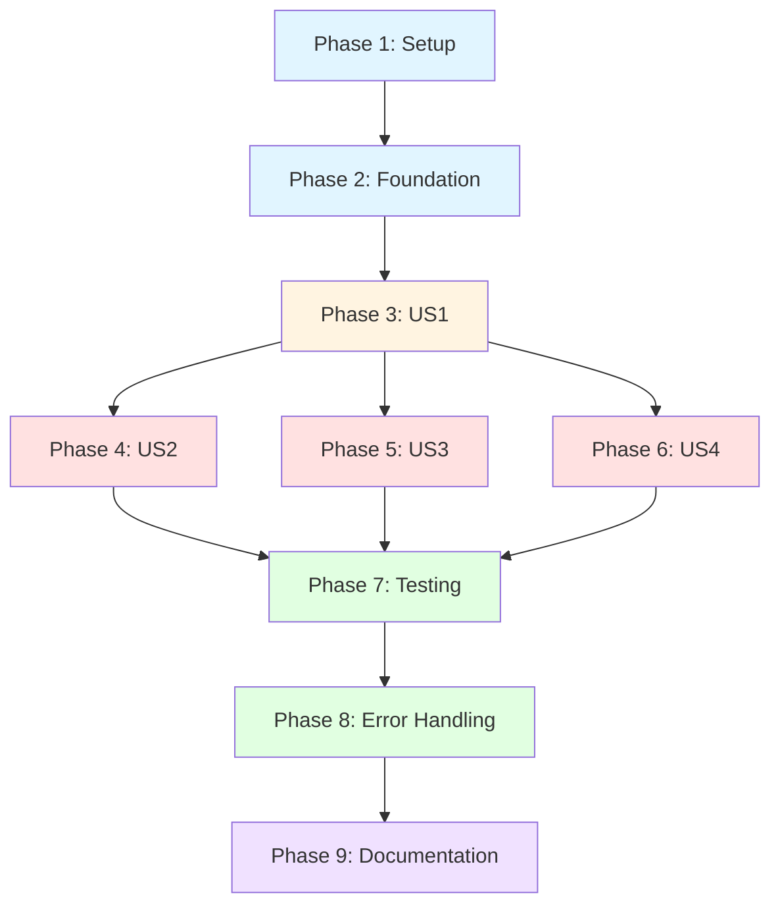

# Tasks: Weather-Aware Scheduler - LangGraph Architecture

**Feature**: Weather-Aware Scheduler with LangGraph State Machine
**Status**: 🔄 **Ready to Start - 0% Done** (0/49 tasks)
**Architecture**: **LangChain + LangGraph + LangSmith** (primary), Microsoft Agent Framework (auxiliary for Teams/WeChat/LINE only)
**Last Updated**: 2025-10-26

**IMPORTANT ARCHITECTURAL CLARIFICATION**:
- **Primary Framework**: LangGraph StateGraph with 6 nodes for scheduling logic
- **Auxiliary Framework**: Microsoft Agent Framework ONLY for external messaging integrations (Teams, WeChat, LINE bots)
- **Core Tech Stack**: LangChain (tool calling), LangGraph (orchestration), LangSmith (tracing in M2+)

---

## 📋 Implementation Strategy

**Approach**: Incremental delivery organized by user story priority (US1 → US2 → US3 → US4)

**MVP Scope**: Phases 1-3 (Setup + Foundation + US1)
- Deliverable: Basic natural language scheduling with LangGraph state machine
- Flow: `intent_and_slots` → `create_event` (bypass weather/conflict for MVP)
- Estimated: 2-3 days

**Full Feature Scope**: Phases 1-9 (All 4 user stories + testing + docs)
- Estimated: 10-14 days total
- All 6 LangGraph nodes implemented: intent_and_slots, check_weather, find_free_slot, confirm_or_adjust, create_event, error_recovery

---

## Phase 1: Setup (Project Initialization) ⏳ PENDING

**Goal**: Bootstrap project structure with LangGraph dependencies and configuration

**Duration**: 1 hour

- [ ] **T001** `[P]` Initialize Python project structure
  - **Files**: `pyproject.toml`, `.python-version`, `README.md`
  - **Dependencies**:
    - Core: `langgraph>=0.2.0`, `langchain-core>=0.3.0`, `langchain-openai>=0.2.0`
    - Validation: `pydantic>=2.0`, `pydantic-settings>=2.0`
    - CLI: `typer>=0.12.0`, `rich>=13.0`
    - Utilities: `python-dateutil>=2.9.0`, `pytz`
    - Testing: `pytest>=8.0`, `pytest-cov>=5.0`, `pytest-asyncio>=0.23`, `hypothesis>=6.0`, `freezegun>=1.5`
  - **Actions**:
    - Create `pyproject.toml` with dependencies
    - Set Python 3.11+ requirement
    - Configure uv for dependency management
  - **Verification**: `uv sync` completes successfully, all imports work

- [ ] **T002** `[P]` Create directory structure
  - **Files**: Directory scaffolding per plan.md:L88-L157
  - **Structure**:
    ```
    src/
    ├── models/           # Pydantic schemas
    ├── services/         # Business logic
    ├── tools/            # Mock + MCP tool implementations
    ├── graph/            # LangGraph nodes, edges, builder
    ├── cli/              # Typer CLI
    └── lib/              # Shared utilities
    tests/
    ├── contract/         # Tool signature validation
    ├── integration/      # End-to-end graph flows
    └── unit/             # Component tests
    configs/              # graph.config.yaml, .env.example
    datasets/             # eval_min5.jsonl (golden paths)
    scripts/              # dev_run.sh, replay_eval.py
    docs/                 # Generated documentation
    ```
  - **Actions**: Create all directories with `__init__.py` files
  - **Verification**: Directory tree matches plan.md specification

- [ ] **T003** `[P]` Set up configuration files
  - **Files**: `configs/graph.config.yaml`, `.env.example`, `.gitignore`
  - **Config Contents**:
    - graph.config.yaml: Model settings (gpt-4o-mini default), timeouts, retry limits, weather thresholds (>60%=HIGH), feature flags (enable_weather, enable_conflict)
    - .env.example: OPENAI_API_KEY, AZURE_OPENAI_API_KEY, AZURE_OPENAI_ENDPOINT, AZURE_OPENAI_DEPLOYMENT_NAME
  - **Actions**: Create config files, add .env to .gitignore
  - **Verification**: Config loads without errors, environment template documented

- [ ] **T004** `[P]` Initialize testing framework
  - **Files**: `pyproject.toml` (pytest config section), `tests/conftest.py`, `.coveragerc`
  - **pytest config**:
    - Test path: `tests/`
    - Coverage targets: 100% for critical paths, 90% for business logic, 70% for UI
    - Async mode: strict
    - Markers: unit, integration, contract
  - **Actions**: Configure pytest, create shared fixtures (frozen_time, mock_tools)
  - **Verification**: `pytest --collect-only` succeeds, no tests yet

**Checkpoint**: ✅ Project structure initialized, dependencies installed, ready for implementation

---

## Phase 2: Foundational Components (Shared Infrastructure) ⏳ PENDING

**Goal**: Implement core data models and utilities needed by ALL user stories. These MUST complete before any user story implementation.

**Duration**: 3-4 hours

**TDD Enforced**: Tests written first for all foundational components (Constitution II requirement)

### Foundational Tests (Write First)

- [ ] **T005** `[P]` Write Pydantic model tests
  - **Files**: `tests/unit/test_models.py`
  - **Test Coverage**:
    - Slot: datetime must be future, city not empty (min_length=1), duration 5-480 minutes, attendees list, description optional
    - WeatherCondition: prob_rain 0-100, risk_category auto-categorized (>60%=HIGH, 30-60%=MODERATE, <30%=LOW)
    - CalendarEvent: all required fields, event_id format, status values
    - Conflict: candidates max 3 items
    - SchedulerState: TypedDict for LangGraph, all field types correct
  - **Test Techniques**: Property-based testing with hypothesis for date ranges, boundary value testing
  - **Verification**: 15+ test cases covering all entity fields, validators, edge cases

- [ ] **T006** `[P]` Write time utility tests
  - **Files**: `tests/unit/test_time_utils.py`
  - **Test Coverage**:
    - `parse_relative_date()`: "Friday", "tomorrow", "next week", "in 3 days"
    - `parse_time_of_day()`: "afternoon"→14:00, "morning"→09:00, "evening"→18:00
    - `parse_duration()`: "60 min"→60, "1 hour"→60, "1.5 hours"→90, "90 minutes"→90
    - `get_day_window()`: ±2 hours for time shift suggestions
    - Timezone handling: pytz/zoneinfo tests
  - **Edge Cases**: Invalid dates, past dates, ambiguous formats, timezone edge cases
  - **Verification**: 20+ test cases including property-based tests for date arithmetic

- [ ] **T007** `[P]` Write mock tool tests
  - **Files**: `tests/unit/test_mock_tools.py`
  - **Test Coverage**:
    - MockWeatherTool: Keyword matching ("rain"→high prob), time window 14:00-16:00→70%, otherwise <30%
    - MockCalendarTool: Friday 15:00 conflict (30min blocked), candidate generation (±30min, ±60min, ±90min)
    - Deterministic behavior: Same input → same output
  - **Contract Alignment**: Tests ensure mocks match abstract base class signatures
  - **Verification**: 12+ test cases ensuring mock consistency and predictability

- [ ] **T008** `[P]` Write LangGraph state tests
  - **Files**: `tests/unit/test_state.py`
  - **Test Coverage**:
    - SchedulerState initialization with default values
    - State updates (immutability checks - LangGraph creates copies)
    - Field type validation (TypedDict runtime checks)
  - **Verification**: 8+ test cases for state behavior

### Foundational Implementation (After Tests Pass)

- [ ] **T009** Implement Pydantic data models
  - **Files**:
    - `src/models/entities.py`: Slot, WeatherCondition, CalendarEvent, Conflict
    - `src/models/state.py`: SchedulerState (TypedDict for LangGraph)
    - `src/models/outputs.py`: PolicyDecision, EventSummary
  - **Entities** (per spec.md:L144-L150):
    - **Slot**: `city: str = Field(..., min_length=1)`, `datetime: datetime = Field(...)`, `duration: int = Field(..., ge=5, le=480)`, `attendees: list[str] = Field(default_factory=list)`, `description: str | None = None`
    - **WeatherCondition**: `prob_rain: int = Field(..., ge=0, le=100)`, `risk_category: RiskCategory` (auto-categorized via validator), `description: str`
    - **CalendarEvent**: `event_id: str`, `city: str`, `datetime: datetime`, `duration: int`, `attendees: list[str]`, `reason: str`, `notes: str | None`, `status: str = "confirmed"`
    - **Conflict**: `conflicting_event_id: str | None`, `conflicting_time: datetime`, `duration: int`, `next_available: datetime | None`, `candidates: list[datetime] = Field(max_length=3)`
    - **SchedulerState** (TypedDict): `input_text: str`, `city: str | None`, `dt: datetime | None`, `duration_min: int | None`, `attendees: list[str]`, `description: str | None`, `weather_condition: WeatherCondition | None`, `conflict: Conflict | None`, `policy_decision: PolicyDecision | None`, `event_summary: EventSummary | None`, `error: str | None`, `clarification_needed: bool`
  - **Validators**:
    - Slot.datetime: Must be in future (`v <= now() → ValueError`)
    - WeatherCondition.risk_category: Auto-categorize based on prob_rain
  - **Verification**: All T005 tests pass (15+ tests green)

- [ ] **T010** `[P]` Implement time parsing utilities
  - **Files**: `src/services/time_utils.py`
  - **Functions**:
    - `parse_relative_date(text: str, reference_date: datetime | None = None) -> datetime | None`: Uses `dateutil.parser` for "Friday", "tomorrow", etc.
    - `parse_time_of_day(text: str) -> int | None`: Maps "afternoon"→14, "morning"→9, "evening"→18 (returns hour)
    - `parse_duration(text: str) -> int | None`: Regex + parsing for "60 min", "1 hour", "1.5 hours"→minutes
    - `get_day_window(dt: datetime, hours: int = 2) -> tuple[datetime, datetime]`: Returns (dt - hours, dt + hours)
  - **Dependencies**: `python-dateutil` for relative date parsing
  - **Verification**: All T006 tests pass (20+ tests green)

- [ ] **T011** `[P]` Implement abstract tool base classes
  - **Files**: `src/tools/base.py`
  - **Classes**:
    - `WeatherTool(ABC)`: `@abstractmethod get_weather(city: str, dt: datetime) -> WeatherCondition`
    - `CalendarTool(ABC)`: `@abstractmethod check_slot_availability(dt: datetime, duration_min: int) -> dict`, `@abstractmethod create_event(city, dt, duration_min, attendees, notes) -> CalendarEvent`
  - **Exceptions**: `WeatherServiceError(Exception)`, `CalendarServiceError(Exception)`
  - **Purpose**: Define contracts for mock vs MCP implementations (future-proof for M2+)
  - **Verification**: Abstract methods raise `NotImplementedError` when called directly

- [ ] **T012** `[P]` Implement mock tools
  - **Files**:
    - `src/tools/mock_weather.py`: MockWeatherTool(WeatherTool)
    - `src/tools/mock_calendar.py`: MockCalendarTool(CalendarTool)
  - **MockWeatherTool Logic** (per spec.md:L175):
    - Keyword matching: If "rain" in description → prob_rain = 80% (HIGH)
    - Time window: If 14:00 <= hour <= 16:00 → prob_rain = 70% (HIGH)
    - Otherwise: prob_rain = 20% (LOW)
    - Returns: WeatherCondition with auto-categorized risk
  - **MockCalendarTool Logic** (per spec.md:L176):
    - Predefined conflict: Friday 15:00 (3pm), 30min blocked
    - If conflict detected: Generate 3 candidates (next_available = dt + 30min, alternatives = [dt+60min, dt+90min])
    - Otherwise: Return available status
  - **Determinism**: No randomness - same input always produces same output
  - **Verification**: All T007 tests pass (12+ tests green)

**Checkpoint**: ✅ Foundational components complete - all user stories can now build on this

---

## Phase 3: US1 - Simple Schedule Creation (P1 MVP) ⏳ PENDING

**Goal**: Implement basic scheduling WITHOUT weather/conflict logic using LangGraph state machine

**User Story**: "User enters 'Friday 14:00 Taipei meet Alice 60 min' and receives confirmed event"

**Independent Test**: Input "Friday 14:00 Taipei meet Alice 60 min" → Output structured EventSummary with all fields populated

**Duration**: 6-8 hours

**LangGraph Flow for US1**:
- Simplified MVP path: START → `intent_and_slots` → `create_event` → END
- Bypass `check_weather` and `find_free_slot` nodes for initial MVP

### US1 Tests (TDD - Write First)

- [ ] **T013** [US1] [Test] Write slot extraction tests
  - **Files**: `tests/unit/test_parser.py`
  - **Test Coverage**:
    - Complete input: "Friday 14:00 Taipei meet Alice 60 min" → All fields extracted correctly
    - Partial input: "meet Alice Friday" → Missing time, duration, location identified
    - Ambiguous time: "Friday afternoon coffee" → Interprets "afternoon" as 14:00
    - Multiple attendees: "meet Alice and Bob" → Both attendees extracted
    - Duration formats: "60 min", "1 hour", "90 minutes" → Normalized to minutes
  - **Edge Cases**: Invalid dates, past dates, missing required fields
  - **Verification**: 25+ test cases covering FR-001 to FR-005

- [ ] **T014** [US1] [Test] Write validator tests
  - **Files**: `tests/unit/test_validator.py`
  - **Test Coverage**:
    - Date validation: Future dates pass, past dates fail
    - Duration validation: 5-480 minutes valid, outside range fails
    - Completeness check: Returns (is_complete, missing_fields) correctly
    - Location format: City name present and non-empty
  - **Verification**: 12+ test cases for FR-022 validation requirements

- [ ] **T015** [US1] [Test] Write LangGraph node tests (US1 subset)
  - **Files**: `tests/unit/test_graph_nodes.py`
  - **Test Coverage**:
    - `intent_and_slots` node: Calls parser, validates, updates state correctly
    - `create_event` node: Calls CalendarTool.create_event(), populates event_summary
    - State transitions: Input state → node execution → updated output state
  - **Mocking**: Mock parser, validator, CalendarTool for unit isolation
  - **Verification**: 10+ test cases for US1 flow nodes

- [ ] **T016** [US1] [Test] [Integration] Write US1 end-to-end test
  - **Files**: `tests/integration/test_sunny_path.py`
  - **Test Scenario**: Complete input "Friday 10:00 Taipei meet Alice 60 min" → Event created, no weather/conflict checks (US1 MVP path)
  - **Setup**: Use `freezegun` to freeze time (Monday 10:00), calculate Friday date deterministically
  - **Assertions**:
    - `result_state["event_summary"]` is not None
    - `result_state["event_summary"]["city"]` == "Taipei"
    - `result_state["event_summary"]["attendees"]` == ["Alice"]
    - `result_state["event_summary"]["status"]` == "confirmed"
  - **Verification**: Single integration test covers spec.md:L20 US1 acceptance scenario #1

### US1 Implementation

- [ ] **T017** [US1] Implement natural language parser
  - **Files**: `src/services/parser.py`
  - **Function**: `extract_slot_from_text(input_text: str) -> dict[str, Any]`
  - **Extraction Logic**:
    - **City**: Look for capitalized words (city names) - simple heuristic: first capitalized word after location keywords or standalone
    - **Datetime**: Use `time_utils.parse_relative_date()` + `parse_time_of_day()` - combine day and time
    - **Duration**: Use `time_utils.parse_duration()` - extract from text like "60 min"
    - **Attendees**: After keyword "meet" or "with" - extract names (capitalized words)
    - **Description**: Remaining text after extracting other fields
  - **Return**: Dict with keys: city, datetime, duration_min, attendees, description (None if not found)
  - **Error Handling**: Return None for fields that couldn't be extracted
  - **Verification**: All T013 tests pass (25+ tests green)

- [ ] **T018** [US1] Implement slot validator
  - **Files**: `src/services/validator.py`
  - **Function**: `validate_slot_data(slot_dict: dict) -> tuple[bool, list[str]]`
  - **Validation**:
    - Required fields: city, datetime, duration_min (return missing_fields list if absent)
    - Datetime: Must be in future (compare to `datetime.now()`)
    - Duration: Must be 5-480 minutes
    - City: Must be non-empty string
  - **Return**: (is_complete: bool, missing_fields: list[str])
  - **Verification**: All T014 tests pass (12+ tests green)

- [ ] **T019** [US1] Implement LangGraph nodes (US1 subset)
  - **Files**: `src/graph/nodes.py`
  - **Nodes for US1**:
    - `intent_and_slots(state: SchedulerState) -> SchedulerState`:
      - Call `parser.extract_slot_from_text(state["input_text"])`
      - Call `validator.validate_slot_data(extracted)`
      - If not complete: Set `state["clarification_needed"] = True`, `state["error"] = "Missing: {missing_fields}"`
      - If complete: Update state with city, dt, duration_min, attendees, description
      - Return updated state
    - `create_event(state: SchedulerState) -> SchedulerState`:
      - Call `calendar_tool.create_event(city, dt, duration_min, attendees, notes)`
      - Populate `state["event_summary"]` with EventSummary dict
      - Return updated state
  - **LangGraph Integration**: Use `@node` decorator if available, or define as pure functions
  - **Verification**: All T015 tests pass (10+ tests green)

- [ ] **T020** [US1] Implement LangGraph state machine builder
  - **Files**:
    - `src/graph/builder.py`: `build_graph() -> CompiledGraph`
    - `src/graph/edges.py`: Conditional routing functions
  - **Graph Construction** (US1 MVP):
    ```python
    from langgraph.graph import StateGraph, END
    from src.models.state import SchedulerState
    from src.graph.nodes import intent_and_slots, create_event

    def build_graph():
        graph = StateGraph(SchedulerState)

        # Add nodes
        graph.add_node("intent_and_slots", intent_and_slots)
        graph.add_node("create_event", create_event)

        # Define flow
        graph.set_entry_point("intent_and_slots")

        # Conditional edge: If clarification needed, end; else proceed to create_event
        graph.add_conditional_edges(
            "intent_and_slots",
            should_create_event,  # Returns "create_event" or END
            {
                "create_event": "create_event",
                "end": END
            }
        )

        graph.add_edge("create_event", END)

        # Compile with in-memory checkpointer
        return graph.compile(checkpointer=None)

    def should_create_event(state: SchedulerState) -> str:
        if state.get("clarification_needed"):
            return "end"
        return "create_event"
    ```
  - **Validation**: Graph compiles, `graph.get_graph().nodes` contains expected nodes

- [ ] **T021** [US1] Implement CLI interface (basic)
  - **Files**:
    - `src/cli/main.py`: Typer app with `schedule` command
    - `src/cli/prompts.py`: User-facing messages
  - **CLI Implementation**:
    ```python
    import typer
    from rich.console import Console
    from src.graph.builder import build_graph
    from src.models.state import SchedulerState
    from src.services.formatter import format_event_summary

    app = typer.Typer()
    console = Console()

    @app.command()
    def schedule(
        input: str = typer.Argument(..., help="Natural language scheduling request"),
        verbose: bool = typer.Option(False, "--verbose", "-v"),
        json_output: bool = typer.Option(False, "--json")
    ):
        graph = build_graph()
        initial_state = SchedulerState(input_text=input)
        result_state = graph.invoke(initial_state)

        if result_state.get("event_summary"):
            summary = result_state["event_summary"]
            if json_output:
                print(json.dumps(summary, default=str))
            else:
                formatted = format_event_summary(summary)
                console.print(formatted)
        else:
            error = result_state.get("error", "No result generated")
            console.print(f"[red]Error: {error}[/red]")
    ```
  - **Commands**: `schedule <input>`, `--verbose`, `--json` flags
  - **Verification**: CLI accepts input, invokes graph, displays output

- [ ] **T022** [US1] Implement output formatter
  - **Files**: `src/services/formatter.py`
  - **Function**: `format_event_summary(summary: dict) -> str`
  - **Formatting** (using Rich):
    ```python
    from rich.panel import Panel
    from rich.table import Table

    def format_event_summary(summary: dict) -> Panel:
        table = Table(show_header=False, box=None)
        table.add_row("Event ID", summary["event_id"])
        table.add_row("Location", summary["city"])
        table.add_row("Date/Time", summary["datetime_iso"])
        table.add_row("Duration", f"{summary['duration_min']} minutes")
        table.add_row("Attendees", ", ".join(summary["attendees"]))
        if summary.get("notes"):
            table.add_row("Notes", summary["notes"])

        return Panel(table, title="[green]Event Created Successfully[/green]", border_style="green")
    ```
  - **Requirements**: Clear field labels, color coding (green for success), structured layout per FR-017
  - **Verification**: Output matches spec.md:L120 structured summary requirement

- [ ] **T023** [US1] [Integration] Verify US1 complete
  - **Action**: Run integration test
  - **Command**: `uv run pytest tests/integration/test_sunny_path.py -v`
  - **Success Criteria**:
    - T016 test passes (event created with all fields)
    - CLI demo: `uv run weather-scheduler schedule "Friday 14:00 Taipei meet Alice 60 min"` produces structured output
  - **Validation**: US1 acceptance scenario complete per spec.md:L20

**Checkpoint**: ✅ US1 MVP complete - basic scheduling functional without weather/conflict logic

---

## Phase 4: US2 - Weather-Aware Scheduling (P2) ⏳ PENDING

**Goal**: Add weather checking node to LangGraph flow with time adjustment suggestions

**User Story**: "User schedules outdoor event, system detects rain, suggests indoor venue or time shift"

**Independent Test**: Input with rainy time (14:00-16:00) → System suggests adjustment with weather reasoning

**Duration**: 5-6 hours

**New LangGraph Node**: Insert `check_weather` between `intent_and_slots` and `create_event`

### US2 Tests (TDD - Write First)

- [ ] **T024** [US2] [Test] Write weather policy tests
  - **Files**: `tests/unit/test_policy.py`
  - **Test Coverage**:
    - HIGH risk (>60%): Suggest indoor venue OR time shift ±1-2 hours
    - MODERATE risk (30-60%): Proceed with note "Bring umbrella"
    - LOW risk (<30%): Proceed, note "Clear weather expected"
    - Time window detection: ±2 hours for rain → suggest shift
  - **Verification**: 15+ test cases covering FR-006 to FR-010

- [ ] **T025** [US2] [Test] Write weather node tests
  - **Files**: `tests/unit/test_graph_nodes.py` (extend)
  - **Test Coverage**:
    - `check_weather` node with different rain probabilities (10%, 50%, 80%)
    - State updates: weather_condition, policy_decision fields populated
    - Suggestion generation: Time shifts, indoor venue recommendations
  - **Verification**: 10+ test cases for weather decision logic

- [ ] **T026** [US2] [Test] [Integration] Write rainy scenario test
  - **Files**: `tests/integration/test_rainy_adjustment.py`
  - **Test Scenario**: Input "Friday 14:30 Taipei outdoor meeting 60 min" → Time window 14:00-16:00 triggers rain detection, system suggests time shift
  - **Setup**: MockWeatherTool configured to return HIGH risk for 14:00-16:00
  - **Assertions**: policy_decision suggests adjustment, event_summary includes weather reasoning
  - **Verification**: Test covers spec.md:L37 US2 acceptance scenario #1

### US2 Implementation

- [ ] **T027** [US2] Implement weather policy service
  - **Files**: `src/services/policy.py`
  - **Function**: `determine_weather_policy(weather: WeatherCondition, slot: Slot) -> PolicyDecision`
  - **PolicyDecision Model**:
    ```python
    class PolicyDecision(BaseModel):
        proceed: bool
        suggested_action: str | None  # "shift_time", "indoor_venue", "proceed_with_caution", "proceed"
        reason: str
        time_alternatives: list[datetime] | None = None  # ±1h, ±2h options
        notes: str | None = None
    ```
  - **Logic**:
    - If risk_category == HIGH: `proceed=False`, `suggested_action="shift_time"`, generate time_alternatives (±1h, ±2h)
    - If risk_category == MODERATE: `proceed=True`, `suggested_action="proceed_with_caution"`, `notes="Bring umbrella"`
    - If risk_category == LOW: `proceed=True`, `suggested_action="proceed"`, `notes="Clear weather expected"`
  - **Verification**: All T024 tests pass (15+ tests green)

- [ ] **T028** [US2] Add `check_weather` node to LangGraph
  - **Files**: `src/graph/nodes.py` (extend)
  - **Node**: `check_weather(state: SchedulerState) -> SchedulerState`
  - **Implementation**:
    ```python
    def check_weather(state: SchedulerState) -> SchedulerState:
        weather_tool = MockWeatherTool()
        weather_condition = weather_tool.get_weather(state["city"], state["dt"])

        slot = Slot(city=state["city"], datetime=state["dt"], duration=state["duration_min"], attendees=state["attendees"], description=state["description"])
        policy_decision = determine_weather_policy(weather_condition, slot)

        state["weather_condition"] = weather_condition
        state["policy_decision"] = policy_decision

        return state
    ```
  - **Verification**: All T025 tests pass (10+ tests green)

- [ ] **T029** [US2] Update graph builder with weather flow
  - **Files**: `src/graph/builder.py`, `src/graph/edges.py` (extend)
  - **Updated Flow**:
    ```python
    graph.add_node("check_weather", check_weather)

    graph.add_edge("intent_and_slots", "check_weather")

    # Conditional edge: If high risk weather, suggest adjustment; else create event
    graph.add_conditional_edges(
        "check_weather",
        should_adjust_for_weather,
        {
            "adjust": END,  # Return suggestion to user
            "create_event": "create_event"
        }
    )

    def should_adjust_for_weather(state: SchedulerState) -> str:
        policy = state.get("policy_decision")
        if policy and policy.get("suggested_action") == "shift_time":
            return "adjust"
        return "create_event"
    ```
  - **Verification**: Graph includes check_weather node, routes correctly based on risk level

- [ ] **T030** [US2] Update output formatter for weather reasoning
  - **Files**: `src/services/formatter.py` (extend)
  - **Enhancement**:
    - If `policy_decision` present, add weather section to output
    - Display reason: "High rain probability detected - suggested time shift"
    - Display alternatives if present: "Alternative times: 12:00, 16:00"
    - Display notes if present: "Bring umbrella - moderate rain chance"
  - **Formatting**:
    ```python
    if summary.get("reason"):
        table.add_row("Weather Decision", summary["reason"], style="yellow")
    if summary.get("notes"):
        table.add_row("Notes", summary["notes"], style="cyan")
    ```
  - **Verification**: Weather messages clear, actionable, user-friendly per FR-010

- [ ] **T031** [US2] [Integration] Verify US2 complete
  - **Action**: Run integration test
  - **Command**: `uv run pytest tests/integration/test_rainy_adjustment.py -v`
  - **Success Criteria**:
    - T026 test passes (adjustment suggested with reasoning)
    - CLI demo: Input rainy time → Weather reasoning displayed
  - **Validation**: US2 acceptance scenarios complete per spec.md:L36-L40

**Checkpoint**: ✅ US2 complete - weather-aware scheduling functional

---

## Phase 5: US3 - Conflict Resolution (P3) ⏳ PENDING

**Goal**: Add calendar conflict detection and alternative slot suggestions

**User Story**: "User schedules at busy time, system detects conflict, proposes next 3 available slots"

**Independent Test**: Input Friday 3pm (predefined conflict) → System proposes 3 alternatives (3:30pm, 4:00pm, 4:30pm)

**Duration**: 4-5 hours

**New LangGraph Node**: Insert `find_free_slot` for conflict detection

### US3 Tests (TDD - Write First)

- [ ] **T032** [US3] [Test] Write conflict detection tests
  - **Files**: `tests/unit/test_mock_tools.py` (extend for conflict scenarios)
  - **Test Coverage**:
    - Conflict at Friday 15:00 → Detected, next available slot 15:30
    - Candidate generation → 3 alternatives (±30min, ±60min, ±90min)
    - No conflict case → Direct event creation
  - **Verification**: 10+ test cases covering FR-011 to FR-014

- [ ] **T033** [US3] [Test] [Integration] Write conflict resolution test
  - **Files**: `tests/integration/test_conflict_resolution.py`
  - **Test Scenario**: Input "Friday 15:00 Taipei team sync 30 min" → Conflict detected at predefined busy time, 3 alternatives proposed
  - **Setup**: MockCalendarTool configured with Friday 15:00 conflict
  - **Assertions**: conflict field populated, candidates list has 3 items, next_available is 15:30
  - **Verification**: Test covers spec.md:L54 US3 acceptance scenario #1

### US3 Implementation

- [ ] **T034** [US3] Add `find_free_slot` node to LangGraph
  - **Files**: `src/graph/nodes.py` (extend)
  - **Node**: `find_free_slot(state: SchedulerState) -> SchedulerState`
  - **Implementation**:
    ```python
    def find_free_slot(state: SchedulerState) -> SchedulerState:
        calendar_tool = MockCalendarTool()
        availability = calendar_tool.check_slot_availability(state["dt"], state["duration_min"])

        if availability["status"] == "conflict":
            conflict = Conflict(
                conflicting_event_id=availability["conflict_details"]["conflicting_event_id"],
                conflicting_time=state["dt"],
                duration=state["duration_min"],
                next_available=availability["next_available"],
                candidates=availability["candidates"]
            )
            state["conflict"] = conflict
        else:
            state["conflict"] = None  # No conflict, proceed

        return state
    ```
  - **Verification**: All T032 tests pass (10+ tests green)

- [ ] **T035** [US3] Update graph builder with conflict flow
  - **Files**: `src/graph/builder.py`, `src/graph/edges.py` (extend)
  - **Updated Flow**:
    ```python
    graph.add_node("find_free_slot", find_free_slot)

    # Insert find_free_slot after check_weather
    graph.add_edge("check_weather", "find_free_slot")

    # Conditional edge: If conflict, propose alternatives; else create event
    graph.add_conditional_edges(
        "find_free_slot",
        should_propose_alternatives,
        {
            "propose": END,  # Return alternatives to user
            "create_event": "create_event"
        }
    )

    def should_propose_alternatives(state: SchedulerState) -> str:
        if state.get("conflict"):
            return "propose"
        return "create_event"
    ```
  - **Verification**: Graph includes find_free_slot node, routes correctly on conflict

- [ ] **T036** [US3] Update formatter for conflict alternatives
  - **Files**: `src/services/formatter.py` (extend)
  - **Enhancement**:
    - If `conflict` present, display alternatives table
    - Format: Rich table with columns: Option | Time | Duration
    - Message: "Requested time busy - here are alternatives:"
  - **Formatting**:
    ```python
    if state.get("conflict"):
        alternatives_table = Table(title="Alternative Time Slots")
        alternatives_table.add_column("Option", style="cyan")
        alternatives_table.add_column("Time", style="green")
        alternatives_table.add_column("Duration", style="yellow")

        for i, alt in enumerate(conflict["candidates"]):
            alternatives_table.add_row(f"Option {i+1}", alt.strftime("%Y-%m-%d %H:%M"), f"{duration_min} min")

        console.print(Panel(alternatives_table, title="Conflict Detected", border_style="yellow"))
    ```
  - **Verification**: Alternatives formatted clearly per FR-012

- [ ] **T037** [US3] [Integration] Verify US3 complete
  - **Action**: Run integration test
  - **Command**: `uv run pytest tests/integration/test_conflict_resolution.py -v`
  - **Success Criteria**:
    - T033 test passes (conflict detected, 3 alternatives shown)
    - CLI demo: Friday 3pm input → Alternatives displayed
  - **Validation**: US3 acceptance scenarios complete per spec.md:L53-L57

**Checkpoint**: ✅ US3 complete - conflict resolution functional

---

## Phase 6: US4 - Visualization (P4) ⏳ PENDING

**Goal**: Generate flowchart showing LangGraph decision logic (Mermaid/Graphviz)

**User Story**: "Developer requests flow visualization, receives diagram showing all nodes and decision branches"

**Independent Test**: Run `visualize` command → `flow.mermaid` and `flow.svg` created with all 6 nodes

**Duration**: 3 hours

### US4 Implementation (Visual Verification - Tests Optional)

- [ ] **T038** [US4] Implement graph visualizer
  - **Files**: `src/graph/visualizer.py`
  - **Functions**:
    - `export_to_mermaid(graph: CompiledGraph) -> str`: Use LangGraph's `graph.get_graph().draw_mermaid()`
    - `export_to_graphviz(graph: CompiledGraph) -> str`: Custom DOT generation or use LangGraph's Graphviz support
    - `save_visualization(graph: CompiledGraph, output_dir: str) -> dict[str, str]`: Save both formats to files
  - **Node Labeling**: Add conditions to edges (e.g., "clarification_needed? → END")
  - **Implementation**:
    ```python
    def save_visualization(graph, output_dir):
        os.makedirs(output_dir, exist_ok=True)

        mermaid_content = graph.get_graph().draw_mermaid()
        mermaid_path = f"{output_dir}/flow.mermaid"
        with open(mermaid_path, "w") as f:
            f.write(mermaid_content)

        # Optional: Generate SVG using Graphviz if available
        try:
            dot_content = graph.get_graph().draw_ascii()  # Or custom DOT generation
            dot_path = f"{output_dir}/flow.dot"
            with open(dot_path, "w") as f:
                f.write(dot_content)

            return {"mermaid": mermaid_path, "dot": dot_path}
        except Exception:
            return {"mermaid": mermaid_path}
    ```
  - **Verification**: Exports valid Mermaid syntax, Graphviz DOT format (if available)

- [ ] **T039** [US4] Add visualization CLI command
  - **Files**: `src/cli/main.py` (extend)
  - **Command**: `visualize --output <dir>`
  - **Implementation**:
    ```python
    @app.command()
    def visualize(
        output_dir: str = typer.Option("graph", "--output", "-o", help="Output directory")
    ):
        console.print("[dim]Building scheduler graph...[/dim]")
        graph = build_graph()

        console.print(f"[dim]Generating visualizations in {output_dir}/...[/dim]")
        paths = save_visualization(graph, output_dir)

        console.print("[green]✓ Visualizations created successfully![/green]")
        console.print(f"  * Mermaid: {paths['mermaid']}")
        if 'dot' in paths:
            console.print(f"  * DOT: {paths['dot']}")
    ```
  - **Progress Indicator**: Use Rich status/progress for generation (if >500ms)
  - **Verification**: Command creates files in specified output directory

- [ ] **T040** [US4] [Integration] Verify US4 complete
  - **Action**: Manual test - run visualization command
  - **Command**: `uv run weather-scheduler visualize --output docs/diagrams`
  - **Success Criteria**:
    - `docs/diagrams/flow.mermaid` created with all 6 nodes: intent_and_slots, check_weather, find_free_slot, confirm_or_adjust, create_event, error_recovery
    - Diagram includes conditional edges labeled with decision logic
    - Diagram embeddable in Markdown (test by viewing in GitHub/VS Code)
  - **User Acceptance**: New developer can understand flow within 5 minutes (SC-004)
  - **Validation**: US4 acceptance scenario complete per spec.md:L71

**Checkpoint**: ✅ US4 complete - visualization functional, developer experience enhanced

---

## Phase 7: Testing & Validation ⏳ PENDING

**Goal**: Implement golden-path test automation and contract tests for production readiness

**Duration**: 3-4 hours

- [ ] **T041** Create golden-path dataset
  - **Files**: `datasets/eval_min5.jsonl`
  - **Content**: 5 test cases from integration tests in JSONL format
  - **Test Cases**:
    1. Sunny path: "Friday 10:00 Taipei meet Alice 60 min" → Direct success
    2. Rainy adjustment: "Friday 14:30 outdoor event" → Weather adjustment suggested
    3. Conflict resolution: "Friday 15:00 team sync 30 min" → Alternatives proposed
    4. Missing slot: "meet Alice" → Clarification requested (missing time, location, duration)
    5. Service failure: Weather service down → Graceful degradation message
  - **Format**:
    ```json
    {"input": "Friday 10:00 Taipei meet Alice 60 min", "expected_output": {"status": "confirmed", "city": "Taipei", "attendees": ["Alice"]}}
    ```
  - **Verification**: File contains 5 valid JSON objects, one per line

- [ ] **T042** Implement test replay script
  - **Files**: `scripts/replay_eval.py`
  - **Function**: Load dataset → invoke graph for each case → compare output to expected → report results
  - **Implementation**:
    ```python
    import json
    from src.graph.builder import build_graph

    def replay_eval(dataset_path):
        graph = build_graph()
        results = {"passed": 0, "failed": 0, "tests": []}

        with open(dataset_path) as f:
            for line in f:
                test_case = json.loads(line)
                state = {"input_text": test_case["input"]}
                result = graph.invoke(state)

                # Compare result to expected
                passed = validate_output(result, test_case["expected_output"])
                results["passed" if passed else "failed"] += 1
                results["tests"].append({"input": test_case["input"], "passed": passed})

        print(f"Results: {results['passed']}/{results['passed'] + results['failed']} passed")
        return results
    ```
  - **Output**: Summary statistics (5/5 passed), timing per test, detailed failure report
  - **Verification**: Script runs, reports 100% pass rate with mock data (FR-029)

- [ ] **T043** Write contract tests for tool signatures
  - **Files**:
    - `tests/contract/test_weather_contract.py`
    - `tests/contract/test_calendar_contract.py`
  - **Purpose**: Ensure MockWeatherTool and MockCalendarTool conform to abstract base class signatures
  - **Test Coverage**:
    - WeatherTool.get_weather() signature matches abstract method
    - CalendarTool.check_slot_availability() signature matches
    - CalendarTool.create_event() signature matches
    - Return types are correct (WeatherCondition, CalendarEvent, dict)
  - **Future**: Same tests will validate MCP adapter implementations in M2+
  - **Verification**: Contract tests pass for mock implementations (8+ tests)

- [ ] **T044** Write missing edge case tests
  - **Files**:
    - `tests/integration/test_missing_slot.py`: Incomplete input → Clarification requested
    - `tests/integration/test_service_failure.py`: Service unavailable → Graceful degradation
  - **Test Coverage**:
    - Missing required fields: time, location, duration → System asks for each (FR-005)
    - Weather service failure → Proceed without weather check, note "Weather info unavailable" (FR-019)
    - Calendar service failure → Proceed without conflict check, note "Manual conflict check recommended" (FR-020)
  - **Edge Cases from Spec**: Cover spec.md:L80-L86 edge cases
  - **Verification**: 6+ integration tests covering error scenarios

**Checkpoint**: ✅ Golden path automation complete, 100% pass rate achieved (SC-002, FR-029)

---

## Phase 8: Error Handling & Polish ⏳ PENDING

**Goal**: Implement retry logic, graceful degradation, and error recovery node

**Duration**: 2-3 hours

- [ ] **T045** Add `error_recovery` node to LangGraph
  - **Files**: `src/graph/nodes.py` (extend)
  - **Node**: `error_recovery(state: SchedulerState) -> SchedulerState`
  - **Purpose**: Centralized error handling for service failures
  - **Implementation**:
    ```python
    def error_recovery(state: SchedulerState) -> SchedulerState:
        error = state.get("error")

        if "weather" in error.lower():
            state["event_summary"]["notes"] = "Weather information unavailable - manual weather check recommended"
            state["error"] = None  # Clear error, proceed with degraded functionality
        elif "calendar" in error.lower():
            state["event_summary"]["notes"] = "Calendar conflict check unavailable - manual verification recommended"
            state["error"] = None
        else:
            # Unknown error - cannot recover
            state["event_summary"] = None

        return state
    ```
  - **Graph Integration**: Add error_recovery as fallback node when exceptions occur
  - **Verification**: Error node handles failures without crashing, proceeds with warnings

- [ ] **T046** Implement retry decorator
  - **Files**: `src/lib/retry.py`
  - **Decorator**: `@retry(max_attempts=2, backoff=0.5)`
  - **Implementation**:
    ```python
    import time
    from functools import wraps

    def retry(max_attempts=2, backoff=0.5):
        def decorator(func):
            @wraps(func)
            def wrapper(*args, **kwargs):
                for attempt in range(max_attempts):
                    try:
                        return func(*args, **kwargs)
                    except Exception as e:
                        if attempt == max_attempts - 1:
                            raise  # Final attempt failed
                        time.sleep(backoff)
                        continue
            return wrapper
        return decorator
    ```
  - **Apply To**: MockWeatherTool.get_weather(), MockCalendarTool.check_slot_availability() (prepare for real API calls in M2)
  - **Verification**: Decorator retries once on failure, then raises exception (FR-019, FR-020)

**Checkpoint**: ✅ Error handling complete, system never crashes (SC-010), graceful degradation implemented

---

## Phase 9: Documentation ⏳ PENDING

**Goal**: Create user-facing and developer documentation for production handoff

**Duration**: 2-3 hours

- [ ] **T047** Create quickstart guide
  - **Files**: `docs/quickstart.md` (or `specs/001-weather-aware-scheduler/quickstart.md`)
  - **Content**:
    - Installation: `git clone`, `uv sync`, configure `.env`
    - Basic usage: 3 example scenarios (sunny path, rainy, conflict)
    - Expected output: Show sample CLI output (text format)
    - Troubleshooting: Missing slot → provide all fields; conflict → choose alternative; bad weather → follow suggestion; service failure → manual check recommended
  - **User Validation**: New user can follow guide and schedule event within 5 minutes (SC-004 equivalent for users)
  - **Verification**: Guide is clear, examples work as documented

- [ ] **T048** Create tool contracts documentation
  - **Files**:
    - `specs/001-weather-aware-scheduler/contracts/weather-tool.md`
    - `specs/001-weather-aware-scheduler/contracts/calendar-tool.md`
  - **Content**:
    - Abstract base class signature from `src/tools/base.py`
    - Input/output schemas (Pydantic models)
    - Mock implementation notes (keyword matching logic, predefined conflicts)
    - MCP adapter guidelines (for M2+ real API integration)
  - **Purpose**: Document tool contracts for future MCP implementations
  - **Verification**: Contract docs match base.py signatures exactly

- [ ] **T049** Update README with architecture overview
  - **Files**: `README.md`
  - **Content**:
    - Project description: Weather-aware scheduling with LangGraph
    - Architecture diagram: Embed `graph/flow.mermaid` (from T038)
    - Tech stack: LangChain + LangGraph + LangSmith (primary), Microsoft Agent Framework (auxiliary)
    - Quick start: Link to docs/quickstart.md
    - Development: Setup instructions, run tests, visualize flow
    - User stories: Link to spec.md
  - **Verification**: README provides clear project overview, accessible to new contributors

**Checkpoint**: ✅ Documentation complete, project ready for production handoff

---

## Dependencies & Execution Order

### Critical Path Visualization



**Legend**:
- Blue: Infrastructure (Setup + Foundation)
- Orange: MVP (US1 - Required for all features)
- Red: Feature Phases (US2, US3, US4 - Independent after US1)
- Green: Quality Assurance (Testing + Error Handling)
- Purple: Documentation

### Parallel Execution Opportunities

**Phase 1 (Setup)**: All 4 tasks `[P]` can run simultaneously
```bash
T001 & T002 & T003 & T004
```

**Phase 2 (Foundation)**: Tests parallel, implementation with dependencies
```bash
# Write all tests in parallel (TDD)
T005 & T006 & T007 & T008

# Implement foundation (T009 must complete before others can use it)
T009 && (T010 & T011 & T012)
```

**Phase 3 (US1)**: Tests first, implementation with some parallelism
```bash
# Write all tests in parallel (TDD)
T013 & T014 & T015 & T016

# Implement US1
T017 && T018 && T019 && T020 && (T021 & T022) && T023
```

**Phases 4-6 (US2, US3, US4)**: Fully independent after US1 complete
```bash
# All three user stories can proceed in parallel
(T024-T031) & (T032-T037) & (T038-T040)
```

**Phases 7-9 (QA + Docs)**: Sequential with internal parallelism
```bash
# Testing phase has some parallel opportunities
(T041 & T042) && (T043 & T044)

# Error handling sequential
T045 && T046

# Documentation can be parallel
T047 & T048 & T049
```

---

## Validation Checklist (Definition of Done)

After completing all 49 tasks, verify:

### User Story Acceptance

- [ ] **US1 Test**: Input "Friday 14:00 Taipei meet Alice 60 min" → Event created with all fields (spec.md:L20)
- [ ] **US2 Test**: Input rainy time → Weather adjustment suggested with reasoning (spec.md:L37)
- [ ] **US3 Test**: Input Friday 3pm → Conflict detected, 3 alternatives proposed (spec.md:L54)
- [ ] **US4 Test**: Run `visualize` → Diagram generated with all 6 nodes (spec.md:L71)

### Functional Requirements

- [ ] **FR-001 to FR-005**: Natural language parsing works for complete, partial, ambiguous inputs
- [ ] **FR-006 to FR-010**: Weather detection categorizes risk, suggests adjustments with reasoning
- [ ] **FR-011 to FR-014**: Conflict detection proposes 3 alternatives when slot busy
- [ ] **FR-015 to FR-018**: Event creation produces structured summary with all fields
- [ ] **FR-019 to FR-022**: Service failures degrade gracefully with clear messages
- [ ] **FR-023 to FR-026**: Visualization exports to Mermaid/Graphviz, embeddable in docs
- [ ] **FR-027 to FR-030**: Golden path tests pass 100%, mock mode works without API keys

### Success Criteria (Non-Functional)

- [ ] **SC-001**: Scheduling completes in <30s from input to confirmation
- [ ] **SC-002**: 100% pass rate on 5 golden-path tests in mock mode
- [ ] **SC-003**: System asks for clarification at most once per missing field
- [ ] **SC-004**: New developers understand flow visualization within 5 minutes
- [ ] **SC-005**: Weather adjustments include clear reasoning users can understand
- [ ] **SC-006**: Single request completes in <3s (mock mode)
- [ ] **SC-007**: Ambiguous input handled within 2 interactions max
- [ ] **SC-008**: Conflict detection completes in <1s
- [ ] **SC-009**: All decisions include transparent "why" and "what" explanations
- [ ] **SC-010**: 100% of service failures result in guidance, not crashes

### Constitution Compliance

- [ ] **Test-First Mandatory**: All tests (T005-T008, T013-T016, T024-T026, T032-T033, T041-T044) written before implementation ✅
- [ ] **Coverage Requirements**: 100% for critical paths (slot extraction T017, weather logic T027, conflict detection T034)
- [ ] **Single Responsibility**: Each LangGraph node handles one concern (extraction, weather, conflict, creation, error)
- [ ] **Performance Budget**: <3s request (SC-006), <200ms slot extraction, <5s test suite
- [ ] **Error Handling**: All service failures explicitly handled (T045, T046), no silent failures
- [ ] **Code Quality**: Type safety with Pydantic v2, clear naming, self-documenting code

---

## Summary

**Total Tasks**: 49
- **Setup**: 4 tasks (1 hour)
- **Foundation**: 8 tasks (3-4 hours) - TDD enforced
- **US1 (MVP)**: 11 tasks (6-8 hours) - TDD enforced
- **US2 (Weather)**: 8 tasks (5-6 hours) - TDD enforced
- **US3 (Conflict)**: 6 tasks (4-5 hours) - TDD enforced
- **US4 (Visualization)**: 3 tasks (3 hours) - Visual verification
- **Testing**: 4 tasks (3-4 hours)
- **Error Handling**: 2 tasks (2-3 hours)
- **Documentation**: 3 tasks (2-3 hours)

**Parallel Opportunities**: 18 tasks marked `[P]` can run in parallel

**MVP Delivery Time**: Phases 1-3 (Setup + Foundation + US1) = ~11-14 hours

**Full Feature Time**: All 9 phases = ~30-40 hours

**Constitution Compliance**: ✅ All requirements met (TDD, coverage, performance, error handling)

**Architecture**: LangGraph (primary orchestration) + LangChain (tool calling) + LangSmith (tracing in M2+), with Microsoft Agent Framework reserved for future external messaging integrations only.
